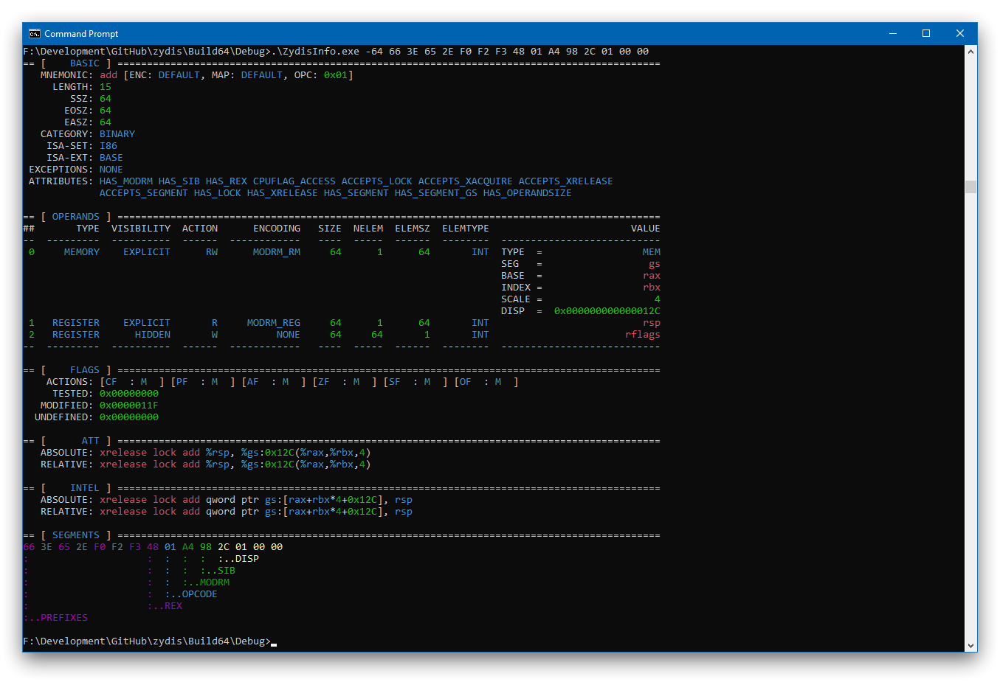

<p align="center">
  
</p>

<p align="center">
  
  <a href="https://github.com/zyantific/zydis/actions"></a>
  <a href="https://gitter.im/zyantific/zydis?utm_source=badge&utm_medium=badge&utm_campaign=pr-badge&utm_content=body_badge"></a>
  <a href="https://discord.zyantific.com/"></a>
</p>

<p align="center">Fast and lightweight x86/x86-64 disassembler library.</p>

## Features
- Supports all x86 and x86-64 (AMD64) instructions and [extensions](./include/Zydis/Generated/EnumISAExt.h)
- Optimized for high performance
- No dynamic memory allocation ("malloc")
- Thread-safe by design
- Very small file-size overhead compared to other common disassembler libraries
- [Complete doxygen documentation](https://zydis.re/doc/3/)
- Absolutely no third party dependencies — not even libc
  - Should compile on any platform with a working C99 compiler
  - Tested on Windows, macOS, FreeBSD, Linux and UEFI, both user and kernel mode

## Quick Example
The following example program uses Zydis to disassemble a given memory buffer and prints the output to the console ([more examples here](./examples/)).

```C
#include <stdio.h>
#include <inttypes.h>
#include <Zydis/Zydis.h>

int main()
{
    ZyanU8 data[] =
    {
        0x51, 0x8D, 0x45, 0xFF, 0x50, 0xFF, 0x75, 0x0C, 0xFF, 0x75,
        0x08, 0xFF, 0x15, 0xA0, 0xA5, 0x48, 0x76, 0x85, 0xC0, 0x0F,
        0x88, 0xFC, 0xDA, 0x02, 0x00
    };

    // Initialize decoder context
    ZydisDecoder decoder;
    ZydisDecoderInit(&decoder, ZYDIS_MACHINE_MODE_LONG_64, ZYDIS_ADDRESS_WIDTH_64);

    // Initialize formatter. Only required when you actually plan to do instruction
    // formatting ("disassembling"), like we do here
    ZydisFormatter formatter;
    ZydisFormatterInit(&formatter, ZYDIS_FORMATTER_STYLE_INTEL);

    // Loop over the instructions in our buffer.
    // The runtime-address (instruction pointer) is chosen arbitrary here in order to better
    // visualize relative addressing
    ZyanU64 runtime_address = 0x007FFFFFFF400000;
    ZyanUSize offset = 0;
    const ZyanUSize length = sizeof(data);
    ZydisDecodedInstruction instruction;
    while (ZYAN_SUCCESS(ZydisDecoderDecodeBuffer(&decoder, data + offset, length - offset,
        &instruction)))
    {
        // Print current instruction pointer.
        printf("%016" PRIX64 "  ", runtime_address);

        // Format & print the binary instruction structure to human readable format
        char buffer[256];
        ZydisFormatterFormatInstruction(&formatter, &instruction, buffer, sizeof(buffer),
            runtime_address);
        puts(buffer);

        offset += instruction.length;
        runtime_address += instruction.length;
    }
}
```

## Sample Output
The above example program generates the following output:

```asm
007FFFFFFF400000   push rcx
007FFFFFFF400001   lea eax, [rbp-0x01]
007FFFFFFF400004   push rax
007FFFFFFF400005   push qword ptr [rbp+0x0C]
007FFFFFFF400008   push qword ptr [rbp+0x08]
007FFFFFFF40000B   call [0x008000007588A5B1]
007FFFFFFF400011   test eax, eax
007FFFFFFF400013   js 0x007FFFFFFF42DB15
```

## Build

#### Unix
Zydis builds cleanly on most platforms without any external dependencies. You can use CMake to generate project files for your favorite C99 compiler.

```bash
git clone --recursive 'https://github.com/zyantific/zydis.git'
cd zydis
mkdir build && cd build
cmake ..
make
```

#### Windows
Either use the [Visual Studio 2017 project](./msvc/) or build Zydis using [CMake](https://cmake.org/download/) ([video guide](https://www.youtube.com/watch?v=fywLDK1OAtQ)).

## Using Zydis in a CMake project
An example on how to use Zydis in your own CMake based project [can be found in this repo](https://github.com/zyantific/zydis-submodule-example).

## `ZydisInfo` tool


## Bindings
Official bindings exist for a selection of languages:
- [Pascal](https://github.com/zyantific/zydis-pascal)
- [Python 3](https://github.com/zyantific/zydis-py)
- [Rust](https://github.com/zyantific/zydis-rs)

Unofficial but actively maintained bindings:
- [Go](https://github.com/jpap/go-zydis)
- [LuaJIT](https://github.com/Wiladams/lj2zydis)

## Versions

#### Scheme
Versions follow the [semantic versioning scheme](https://semver.org/). All stability guarantees apply to the API only — ABI stability between patches cannot be assumed unless explicitly mentioned in the release notes.

#### Branches & Tags
- `master` holds the bleeding edge code of the next, unreleased Zydis version. Elevated amounts of bugs and issues must be expected, API stability is not guaranteed outside of tagged commits.
- Stable and preview versions are annotated with git tags
  - beta and other preview versions have `-beta`, `-rc`, etc. suffixes
- `maintenance/v2` contains the code of the latest legacy release of v2
  - v2 is now deprecated, but will receive security fixes until 2021

## Credits
- Intel (for open-sourcing [XED](https://github.com/intelxed/xed), allowing for automatic comparision of our tables against theirs, improving both)
- [LLVM](https://llvm.org) (for providing pretty solid instruction data as well)
- Christian Ludloff (http://sandpile.org, insanely helpful)
- [LekoArts](https://www.lekoarts.de/) (for creating the project logo)
- Our [contributors on GitHub](https://github.com/zyantific/zydis/graphs/contributors)

## Troubleshooting

#### `-fPIC` for shared library builds

```
/usr/bin/ld: ./libfoo.a(foo.c.o): relocation R_X86_64_PC32 against symbol `bar' can not be used when making a shared object; recompile with -fPIC
```

Under some circumstances (e.g. when building Zydis as a static library using
CMake and then using Makefiles to manually link it into a shared library), CMake
might fail to detect that relocation information must be emitted. This can be forced
by passing `-DCMAKE_POSITION_INDEPENDENT_CODE=ON` to the CMake invocation.

## Donations

Since GitHub Sponsors currently doesn't support sponsoring teams directly, donations are collected and distributed using [flobernd](https://github.com/users/flobernd/sponsorship)s account.

## License

Zydis is licensed under the MIT license.
